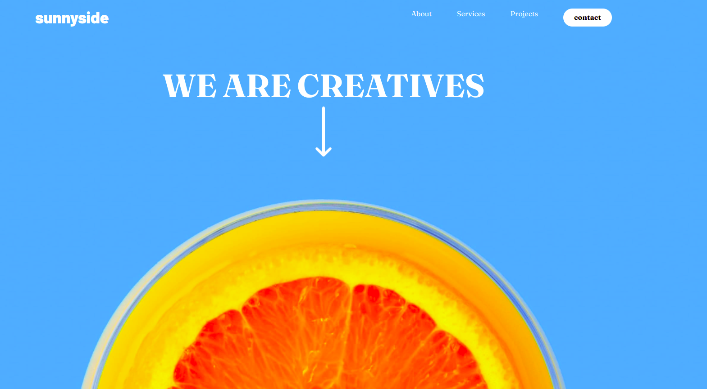

# Frontend Mentor - Sunnyside agency landing page solution

This is a solution to the [Sunnyside agency landing page challenge on Frontend Mentor]().

## Table of contents

## Overview
This is a marketing agency landing page built with Tailwind and JavaScript.

## The Challenge
 The challenge involved creating a a mobile-responsive landing page. Users should be able to:
 - View different layouts across different screens.
 - Toggle the navbar to reveal a drop-down menu on a mobile screen
 - View hover states for multiple elements.
 - View animation on the scroll arrow.

 ## Screenshot
 

 ## Live Site
 https://landingpage-catherinekiiru.netlify.app/

 ## My Process
 I began the project my mapping out all the sections needed into divs. Then I add all the configurations required in the Tailwind config file. I added colors, screen sizes, and background images. This helped in writing clean code because I could just state the specific class for each element I added in the config file, instead of adding the relative paths to some of the links. 

 I first worked on the mobile design functionality, where I used an event listener method to toggle the hamburger menu. Then i added the sizings for different screens after working on the mobile design. 

 ## Built With
- Tailwind
- Mobile-first workflow
- JavaScript

## What I learnt
- I learnt how to flip grids from mobile to desktop
- I learnt how to center background images with mx-auto
- I learnt how to add animatins to elements
- I learnt a new implementation for the hamburger menu functionality
I learnt how to apply the flex-1 utility which is useful for mobile design.

## Useful Resources
- [Backgound image sizing](https://play.tailwindcss.com/oT80ySVJ6f) - This introduced me to the h-screen utility which adjusts an element to the viewport's height. It helps in sizing backgound images expecially for mobile screens. 

## Author
Catherine Kiiru

